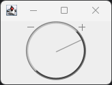

# com.marginallyclever.Dial



A Java Swing dial that can be turned with the mouse wheel, mouse click+drag, or the keyboard +/- keys.

Attach an `ActionListener` to receive the `turn` command when the dial is turned.

## Usage

```java
import com.marginallyclever.dial.Dial;
import javax.swing.*;
import java.awt.event.ActionEvent;
import java.awt.event.ActionListener;

public class DialDemo {
    public static void main(String[] args) {
        JFrame frame = new JFrame("Dial Demo");
        Dial dial = new Dial();
        
        dial.addActionListener(new ActionListener() {
            @Override
            public void actionPerformed(ActionEvent e) {
                System.out.println("Dial turned: " + dial.getValue());
            }
        });

        frame.add(dial);
        frame.setSize(200, 200);
        frame.setDefaultCloseOperation(JFrame.EXIT_ON_CLOSE);
        frame.setVisible(true);
    }
}
```

## More Info

See https://www.marginallyclever.com/2024/07/friday-facts-20-java-swing-dial-ux/